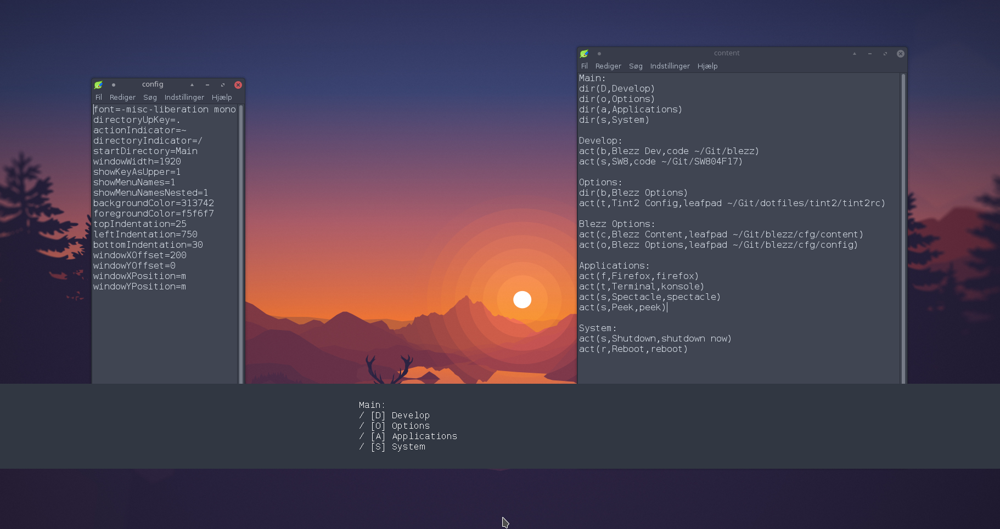

# Blezz - Guided Keystroke Launcher



## Idea
Complicated shortcuts are hard to remember and hard on the fingers, yet it is still nice to have shortcuts to scripts and used actions readily available.

With Blezz i intend to give an alternative to shortcut systems. It provides a little interface that shows up at launch, to guide the user through his own setup. Every keypress can go to new directory, or execute an action. It is possible for the user to make his own setup as simple or complex he wants, by adding content to a file.

As it is possible to execute shell scripts from Blezz almost any action imaginable is possible.

## Install
Inspect the makefile if you feel paranoid. Afterwards, do:

```
make
sudo make install
```

### Dependencies
**Building**: `argp` and `xcb` and their headers are needed for building this project.

**Running**: systemd is required to only allow one running instance. 

The packages can normally be found in your distros repos, but their name varies, below i list the packages, that should contain the needed libraries, for some distros. 

If any mistakes are found, please let me know in the issues.

#### On Ubuntu
```
apt install libxcb1-dev libxcb-icccm4-dev libxcb-ewmh-dev
```

#### On Fedora
```
dnf install libxcb-devel xcb-util-devel xcb-util-wm-devel
```

#### On Arch
```
pacman -S libxcb xcb-util xcb-util-wm
```

## Uninstall
If copied to the `/usr/bin` directory, make uninstall removes it, effectively uninstalling it.

_Note: Any configuration file made for the program will remain_

```
sudo make uninstall
```

## Configuration
There is two possible ways to configure Blezz.
The content file is mandatory for getting any use out of the program.
The config file is providing optional information about how the program should run.

### Content file
A basic language have been formed to provide structural information about what the user wants to browse when he runs Blezz.

_Note: The first directory declared will be the starting menu, until more configuration is possible._

_Note: It does not matter if a directory is declared before or after being reffered to._

```
#This is a comment.
directoryName:                    #Defines the name of a directory for linking.
dir(char,linkedDirectory)         #Links to another directory. Binds to last mentioned directory.
act(char,description,bashCommand) #Executes the command. Binds to last mentioned directory.
```
(An example can be found in `cfg/content`)

### Config file
A very basic configuration file can be formed by a single type of statements.
```
name=value
```
The options for this file is:

|               Name|Value                                                                      |Default |
|------------------:|:--------------------------------------------------------------------------|:-------|
|               font|Name of an x font. (Find by using `xlsfonts`)                              |`fixed` |
|     directoryUpKey|Character that on keypress will go a level up.                             |`.`     |
|    actionIndicator|Character shown before actions to indicate that they are actions.          |`!`     |
| directoryIndicator|Character shown before directories to indicate that they are directories.  |`>`     |
|     startDirectory|Name of the start directory.                                               |`Main`  |
|        windowWidth|Width in pixels.                                                           |`600`   |
|      showMenuNames|1 or 0 as true or false.                                                   |`1`     |
|showMenuNamesNested|1 or 0 as true or false.                                                   |`1`     |
|    backgroundColor|RGB as hexadecimals, eg: `ff122a`.                                         |`000000`|
|    foregroundColor|RGB as hexadecimals, eg: `ff122a`.                                         |`ffffff`|
|     topIndentation|Numbers of pixels between the top border and the text.                     |`5`     |
|    leftIndentation|Numbers of pixels between the left border and the text.                    |`20`    |
|  bottomIndentation|Numbers of pixels between the bottom border and the text.                  |`10`    |
|    windowXPosition|Must be either `l`, `m`, or `r` sets initial placement according to screen.|`m`     |
|    windowYPosition|Must be either `t`, `m`, or `b` sets initial placement according to screen.|`t`     |
|      windowXOffset|Offset on the x axis in pixels from initial placement.                     |`0`     |
|      windowYOffset|Offset on the y axis in pixels from initial placement.                     |`0`     |

(An example can be found in `cfg/config`)

## Usage
How to start, control, and exit Blezz.

### Start
To run Blezz, simply call it with optional paths to your configuration file like this:

```
./bin/blezz -c ./cfg/config -p ./cfg/content -d SuperStartDir
```

The extra arguments can be avoided by:
saving your config file as `$(HOME)/.config/blezz/config`.
saving your content file as `$(HOME)/.config/blezz/content`.
having your intended start directory named `Main`.

### Controls
Controls are, with the current exception of `ESC`, configurable through the config file, this is the defaults.

|    Key|Action            |
|------:|:-----------------|
|  `ESC`|Closes the menu.  |
|    `.`|Goes up a level.  |
|`A`-`Z`|Select an element.|

### Exit
Terminate Blezz by pressing the close button or going a level up from the starting directory.

## TODO
You are more than welcome to open issues, or contribute on any of the currently opened ones.
